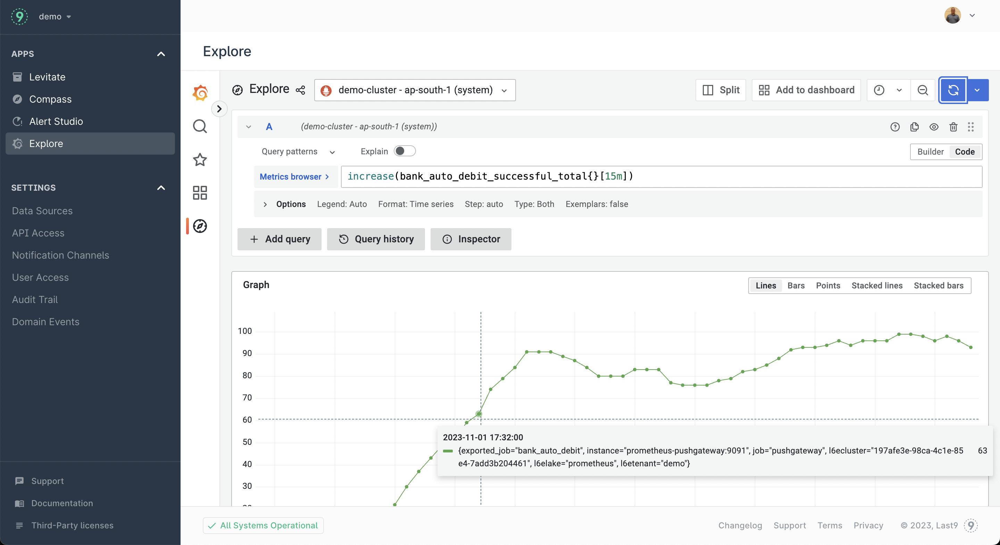

# FaaS Monitoring

This repository contains a Python function as a service. This includes a Docker Compose setup for running the program and pushing metrics to a Prometheus Pushgateway. The Docker Compose also includes a vmagent that scrapes the Pushgateway and remote writes to any prometheus compatible TSDB.

## Table of Contents

- [Prerequisites](#prerequisites)
- [Getting Started](#getting-started)
- [Usage](#usage)

## Prerequisites

Before you begin, ensure you have met the following requirements:

- Docker: You should have Docker installed to run the Python program within a container.
- Docker Compose: Make sure Docker Compose is installed for orchestrating the services.

## Usage

1. Clone this repository to your local machine:

   ```bash
   git clone https://github.com/last9/faas-monitoring
   cd faas-monitoring
   ```
2. Add your [Levitate](https://last9.io/levitate-tsdb/) remote write URL [here](https://github.com/last9/faas-monitoring/blob/c7d7ffb43bb19aeb90a0490136176bd1849439ed/docker-compose.yaml#L40)
3. Run the Docker Compose setup:
    ```bash
    docker-compose up -d  
    ```
4. Visit your grafana dashboard to view your metrics
   
